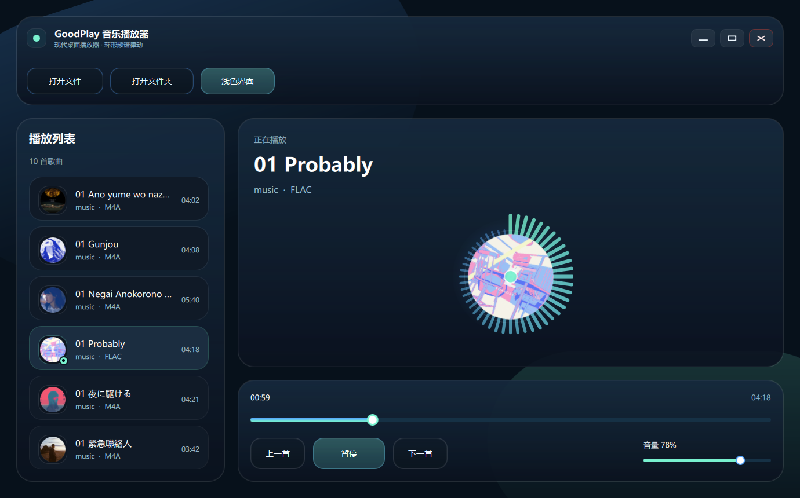

# GoodPlay 音乐播放器

一款基于 `C++ + Qt 6 + QML` 开发的桌面音乐播放器，强调现代、简约、统一的视觉风格，并提供圆形封面唱片、环形频谱律动、深浅主题切换、自定义标题栏等体验。

## 功能特性

- 打开单个音频文件
- 打开文件夹并自动递归导入其中的音频文件
- 播放 / 暂停、上一首 / 下一首
- 播放进度条与音量调节
- 播放列表展示歌曲标题、副标题、时长、封面
- 播放到最后一首后自动回到第一首，循环播放
- 圆形专辑封面显示，播放时持续旋转，暂停时保留当前角度
- 环形音乐频谱律动效果
- 深色 / 浅色界面切换
- 自定义标题栏，支持最小化、最大化、关闭
- Windows 下可打包为安装程序

## 支持格式

当前项目已适配常见音频格式：

- `MP3`
- `WAV`
- `FLAC`
- `M4A`
- `AAC`
- `OGG`
- `OPUS`
- `WMA`

## 界面截图

### 深色界面



### 浅色界面


## 技术栈

- `C++20`
- `Qt 6`
- `QML / Qt Quick / Qt Quick Controls 2`
- `Qt Multimedia`
- `CMake`
- `Inno Setup`

## 项目亮点

- 使用 `QML` 构建现代化界面，布局清晰，视觉统一
- 使用 `Qt Multimedia` 实现音频播放、进度控制与音量控制
- 播放列表支持后台扫描导入，减少打开大文件夹时的卡顿
- 专辑封面支持元数据读取，并对部分格式增加了 `ffmpeg` 兜底提取
- 频谱动画与播放器核心逻辑解耦，兼顾观感与性能

## 构建方式

### 环境要求

- Qt `6.8+`，推荐 `Qt 6.11`
- `CMake 3.21+`
- Windows + MinGW Kit

### 配置

```bash
cmake -S . -B build -G Ninja ^
  -DQt6_DIR=G:/Qt/6.11.0/mingw_64/lib/cmake/Qt6 ^
  -DCMAKE_PREFIX_PATH=G:/Qt/6.11.0/mingw_64
```

### 编译

```bash
cmake --build build
```

编译完成后，可执行文件位于：

```text
build/musicplayer.exe
```

## 运行说明

- 首次打开可通过“打开文件”或“打开文件夹”导入音频
- 打开文件夹时，会先快速生成播放列表，再在后台补充时长与真实封面
- 若系统环境中可用 `ffmpeg`，部分音频格式的内嵌封面读取兼容性会更好

## 目录说明

- `src/`：C++ 源码
- `qml/`：QML 界面与组件
- `resources/`：应用图标与资源文件
- `assets/`：素材资源
- `img/`：README 截图
- `installer/`：安装包脚本与产物

## 许可证

当前仓库未单独声明许可证，如需开源发布，建议补充 `LICENSE` 文件。
